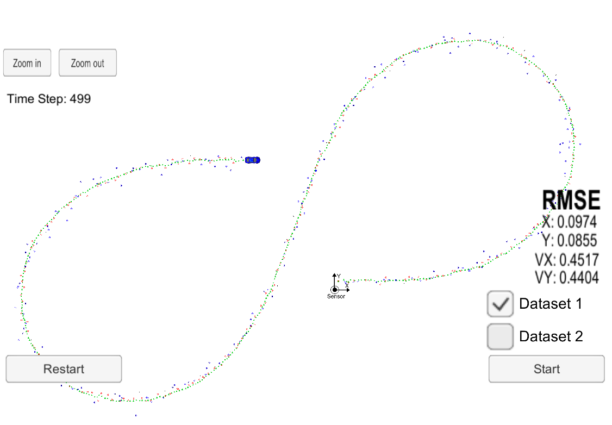

This is a project in Udacity Nanodegree for Self-driving car, forked from [CarND-Behaviorial-Cloning-P3](https://github.com/udacity/CarND-Extended-Kalman-Filter-Project).

# Extended Kalman Filter
The goal of this project is to build a scheme for fusion of a radar sensor and a lidar snsor for estimation of location and speed of an observable using Kalman's filter. A code template is prepared to simplify the implementation by only adding the necessary code for use of implementation of Kalman filter. The details for installation of necessary libraries and building the application is given in the original repository and are not repeated here.

The solution has to handle two types of sensors: 
1. Lidar is a sensor that gives information about the position of the object related to the position of the sensor. The output is a two-dimensional position vector in a plane. The velocity of the object is not measured directly. The output in in the Cartesian coordinate system.
2. Radar measures the radial and angular position of an object related to the sensor position and in addition, using Doppler effect, it can measure the radial velocity of the object. The output is in the Polar coordinate system.

In this project, the Cartesian position and velocity is chosen as state vector, http://latex.codecogs.com/svg.latex?%24%5Cbar%7Bx%7D%24, i.e. 

http://latex.codecogs.com/svg.latex?%24%24%5Cbar%7Bx%7D%3D%5Cleft%5B+%5Cbegin%7Barray%7D%7Bc%7Dp_x%5C%5C+p_y%5C%5C+v_x%5C%5C+v_y%5Cend%7Barray%7D%5Cright+%5D+%24%24

where, the first two components are position coordinates and the secend two corresponding speeds.

With the above choice of stare vectors, the relation between the Lidar measurement and the prediction becomes linear and the standard Kalman filter can be used. The output of the radar sensor is related to the state vectors in a nonlinear fashion through

http://latex.codecogs.com/svg.latex?%24%24+%5Cleft%5B+%5Cbegin%7Barray%7D%7Bc%7D%5Crho%5C%5C+%5Ctheta%5C%5C+%5Cdot%7B%5Crho%7D%5Cend%7Barray%7D%5Cright+%5D+%3D+%0D%0A+%5Cleft%5B+%0D%0A+++++%5Cbegin%7Barray%7D%7Bc%7D%5Csqrt%7Bp_x%5E2+%2B+p_y%5E2%7D%5C%5C+%0D%0A+++++%5Carctan%28%5Cfrac%7Bp_y%7D%7Bp_x%7D%29%5C%5C+%0D%0A+++++%5Cfrac%7Bp_xv_x%2Bp_y+v_y%7D%7B%5Csqrt%7Bp_x%5E2+%2B+p_y%5E2%7D%7D%0D%0A+++++%5Cend%7Barray%7D%0D%0A%5Cright+%5D+%0D%0A%24%24

therefore, the Extended Kalman Filter needs to be used.

All steps in the implementation, except the extension of Kalman filter, have been explained and implemented in the course and quizes. I have basically copied the code from earlier quizes into the code here. The difference between the standard Kalman filter and the extention to the nonlinear problems is that in the extended version, the estimate of the measurement from prediction is calculated through the nonlinear relation and further the $H$ matrix is replaced with the Jacobian of the forementioned relation. Details were explained in the course material and can be found in the code. A summary of the steps can be the following:

- At first step, only initialize the state vector with the measurement data and record the timestamp.
- In other steps do the following:
    - Execute the prediction step and predict the new state vector using the data from previous step.
    - Update the covariance matrix.
    - If the measurement is from Lidar, use standard Kalman filter and update the state vector.
    - If the measurement is from Radar, use the extended Kalman filter and update the state vector.
- RMSE values are computed and sent together with the new state vector to the simulator for visualization.

# Implementation
After cloning the Git repository and installation of uWebSockets and cmake on Ubuntu, the three files kalman_filter.cpp, FusionEKF.cpp and tools.cpp were completed accoroding to the instructions given in the project description and markings in the code. Few points to be highlighted are:
1. In the conversion of coordinates between Cartesian and Polar coordinates, a minimum value was used for radial distance, x and y to avoid problems with division by zero.
2. Likewize, the values of square and cube of radial distance in calculation of Jacobian were limited to avoid large errors due to divisin by a small value.
3. The second component of the error vector in radar measurement, i.e. the angle, was limited to the interval http://latex.codecogs.com/svg.latex?%24%5B-%5Cpi%2C%5Cpi%5D%24 for consistency in the calculation of the update state.

# Efficiency of the code
There are no unnecessary compuaition in the main loop. There only part that could be improved is the creation of temporary variable that could be eliminated by definition of global variables. This step has not been taken in favor of readability and reliability of the code.

# Compiling and execution

To run the program, you need to go to the build direectory and first compile the code by executing the command

```
$ make
```
This command compiles the coded and links them. The output is an executable called 'ExtendedKF' that can be executed by 

```
$ ./ExtendedKF
```
This starts the webserver that waits for port 4567 for connection. Once the simulator is started, the connection will be established and the test will run.

# Results
The test should run after the above steps and expected results are obtailed as shown below.
<p align="center">

</p>

